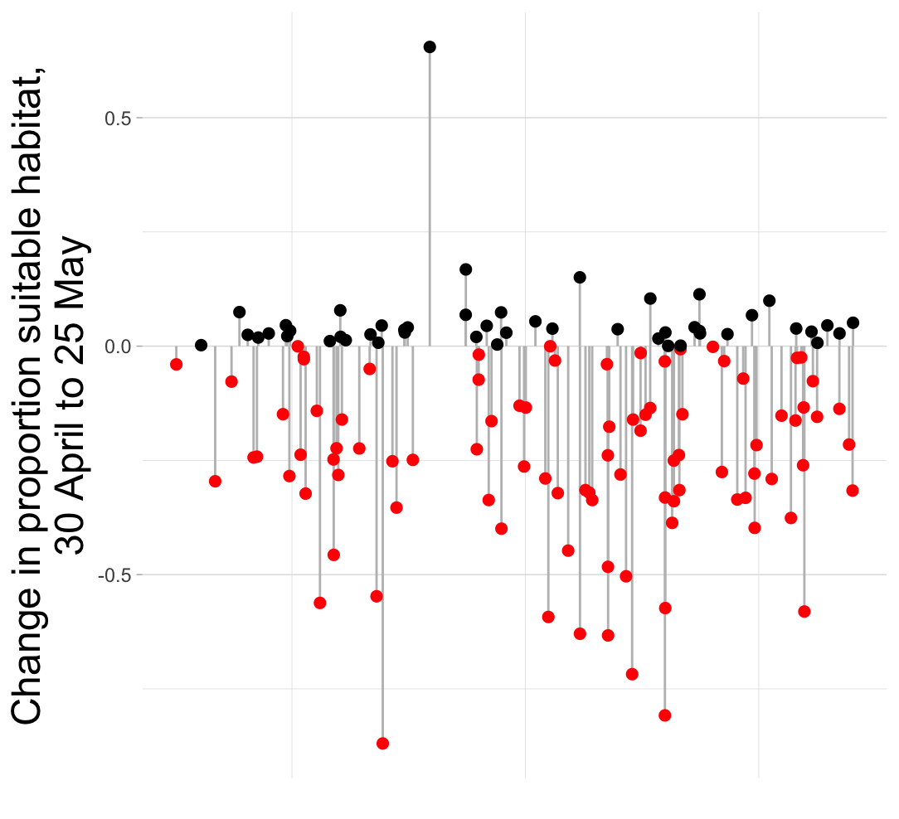
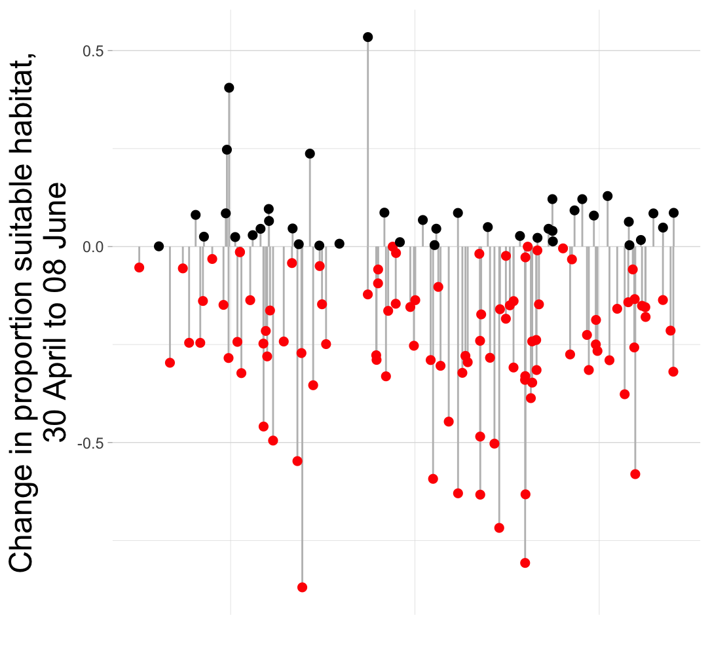
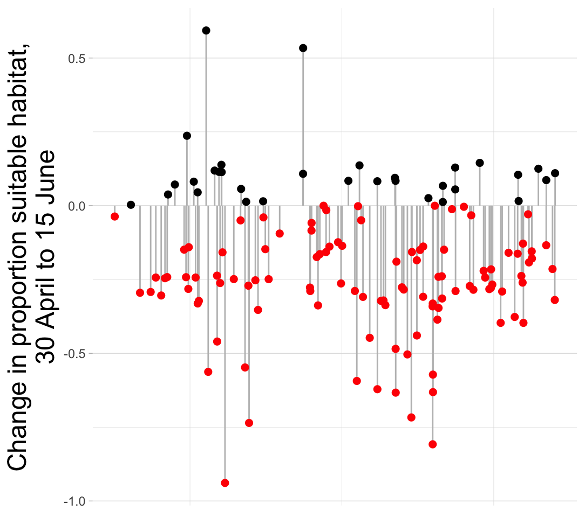
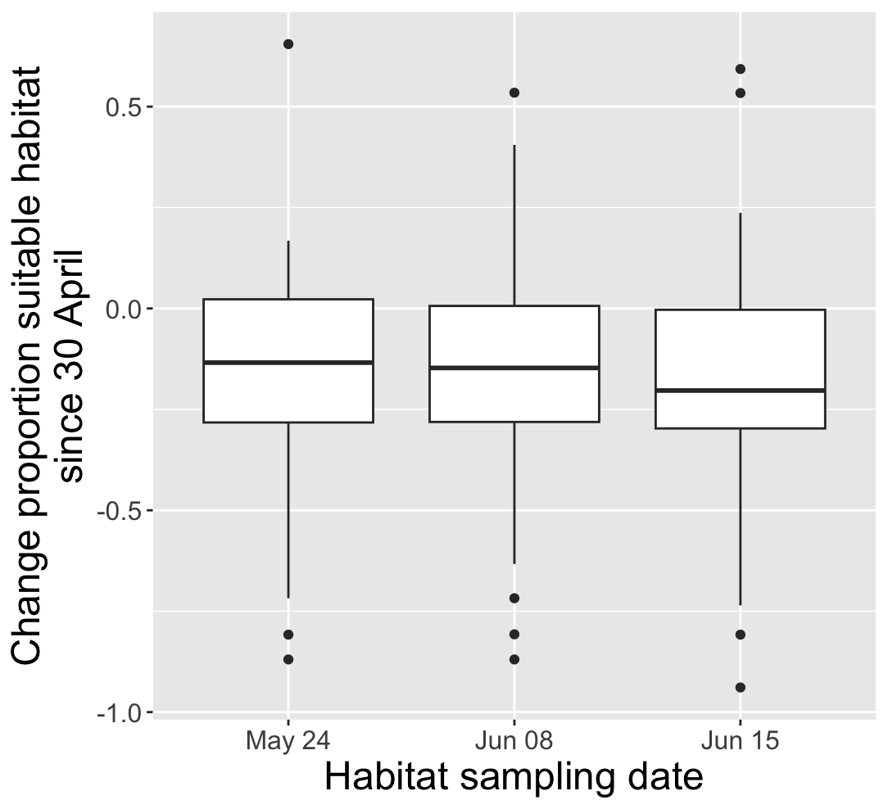

# Introduction

This report describes patterns of change in habitat suitability for Streaked Horned Larks (hereafter, larks) in the Willamette Valley of Oregon and provides a preliminary assessment of the relationship between detections of larks during surveys and estimated habitat quality.

# Results

## Temporal dynamics of estimated habitat suitability

Habitat suitability for larks in the Willamette Valley of Oregon was estimated via remote sensing on four dates in 2025. The first date on which satellite imagery was evaluated for lark habitat suitability, April 30, occurred before point-count surveys for larks were conducted; the remaining 3 dates - May 24, June 08, and June 15 - occurred contemporaneously with point-count surveys.

Estimated habitat suitability tended to decline, sometimes sharply, between April 30 and all of the other dates on which suitability was estimated (Figs. 1-4).

Although estimated habitat suitability tended to decline from April to June, individual points showed substantial variation from one sampling period to the next. Many points alternated between relatively high and relatively low suitability over the 4 sampling periods (Fig. 5).

## Associations between estimated habitat suitability and detection of larks

No association was evident between the number of larks detected at a point and the estimated proportion of suitable habitat at a point (Figs. 6-9).

# Conclusions

The estimated area of suitable habitat at a survey point was unstable over very short time spans. For example, notice the group of points predicted to contain about 50% suitable habitat on 24 May, about 0% suitable habitat on 08 June, and then again about 50% suitable habitat on 15 June (Fig. 5). Larks in the Willamette Valley occupy a dynamic landscape, in which rapid changes in habitat suitability can occur (e.g., due to agricultural practices), but the nature of the changes in the estimated extent of suitable habitat suggest that much of the observed variation does not reflect ecological variation but is instead an artifact of the estimation process or the satellite imagery used to predict suitable habitat. It is unlikely that, for example, a survey point would be uninhabitable one week, replete with suitable habitat two weeks later, and then once again uninhabitable a week later.

The instability of the predictions of habitat extent suggests that the underlying model fails to yield biological relevant results in the Willamette Valley. It is not surprising then that the number of lark detections was uncorrelated with the estimated extent of suitable habitat; if the predicted extent of suitable habitat is an essentially random variable, then we should not expect it to show any consistent relationship with the distribution or abundance of larks. Based on this preliminary analysis, the existing habitat model has little value in predicting occurrence, distribution, or extent of habitat in the Willamette Valley, and as such has no utility for estimating total population size of larks in the Willamette Valley. In addition to the difficulties experienced in generating precise estimates of lark density, as discussed in previous reports, the lack of a reliable measure of the extent of lark habitat in the Willamette Valley precludes extrapolating density estimates from this study to predict total population size.
